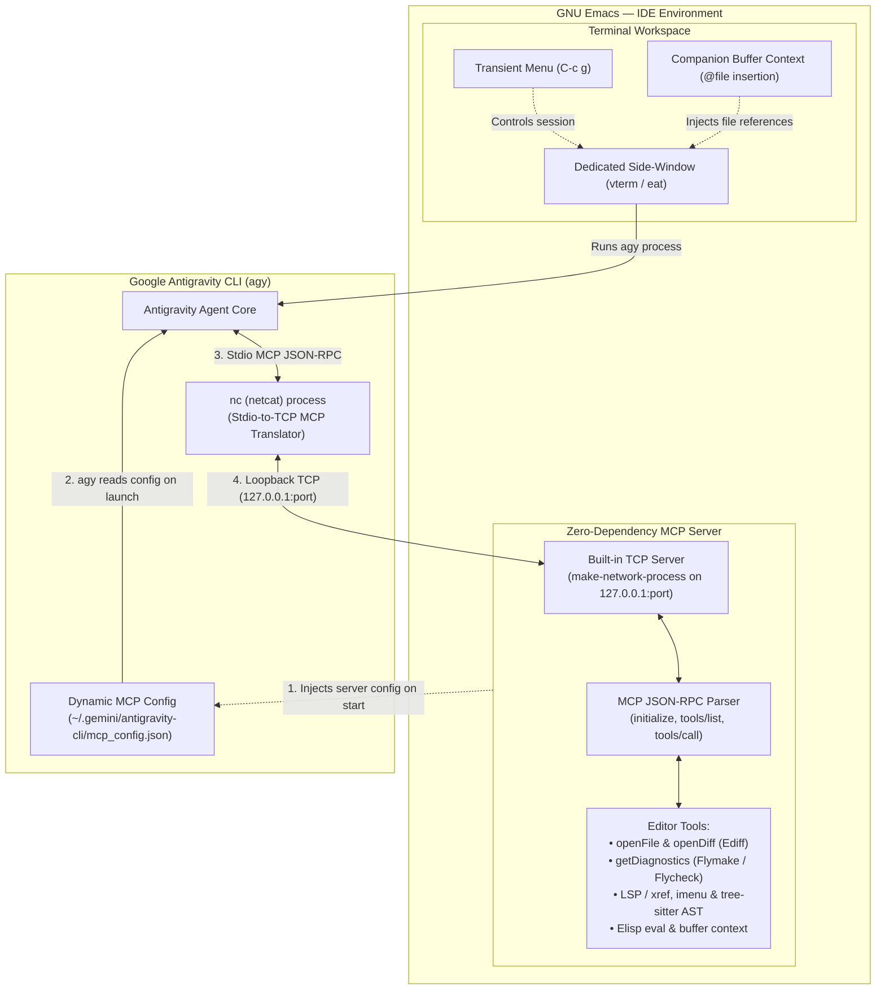

# Antigravity CLI IDE for Emacs

**Native GNU Emacs IDE integration for Google Antigravity CLI (`agy`)** powered by a zero-dependency **Model Context Protocol (MCP)** bridge.

Unlike simple terminal wrappers, `antigravity-cli-ide` creates a bidirectional integration between Antigravity and GNU Emacs:
- **Rich IDE Environment**: Seamless terminal sessions (`vterm` or `eat`) hosted in dedicated side-windows, companion buffer tracking for `@file` context injection into CLI prompts, and a comprehensive `transient` menu (`C-c g`).
- **Zero-Dependency MCP Tool Bridge**: Emacs acts as an official MCP server, allowing Antigravity to directly inspect compiler diagnostics (Flymake/Flycheck), run AST syntax queries (Tree-sitter), navigate code definitions (Xref/LSP), perform interactive diffing (Ediff), and open buffers.
- **Pure Netcat-to-TCP Architecture**: Emacs uses its built-in C-level TCP socket server (`make-network-process`) paired with the standard Unix/Linux `nc` (netcat) utility. No Node.js, Python sidecar, `websocket.el`, or `web-server.el` dependencies are required.

---

## 🚀 Architecture & Data Flow

When a session starts, Emacs provisions a local TCP socket, dynamically configures `~/.gemini/antigravity-cli/mcp_config.json`, and launches `agy` in a dedicated terminal window:



### Session Lifecycle
1. **TCP Socket Allocation**: Emacs finds a free port in `antigravity-cli-ide-mcp-port-range` (10000–65535) and starts a native TCP server bound exclusively to `127.0.0.1` using `make-network-process`.
2. **Dynamic MCP Config Injection**: Emacs safely reads `~/.gemini/antigravity-cli/mcp_config.json` (preserving all existing custom servers) and registers the bridge:
   ```json
   "mcpServers": {
     "antigravity-emacs-tools": {
       "command": "nc",
       "args": ["127.0.0.1", "<PORT>"]
     }
   }
   ```
3. **Interactive Terminal Launch**: Emacs opens a dedicated `vterm` or `eat` buffer in a side window running `agy`. As `agy` initializes, it reads `mcp_config.json`, starts `nc` as its MCP connector, and establishes a bidirectional TCP stream back to Emacs.
4. **Clean Restoration & Teardown**: When the session ends or the terminal buffer is killed, Emacs stops the TCP server, removes the `antigravity-emacs-tools` entry, and cleanly restores `mcp_config.json`.

---

## 📂 Package Modules

The package consists of the following modules in this directory:

* **`antigravity-cli-ide.el`**: Main entry point managing processes, term-buffer lifecycles, and window configurations.
* **`antigravity-cli-ide-mcp.el`**: The TCP socket server, JSON-RPC line parser, and `mcp_config.json` dynamic writer/cleanup.
* **`antigravity-cli-ide-transient.el`**: A gorgeous, interactive Transient menu for all start, stop, navigation, and debugging commands.
* **`antigravity-cli-ide-emacs-tools.el`**: Built-in Emacs tools exposed to the LLM (xref for LSP/references, imenu navigation, tree-sitter AST explorer, and project metadata).
* **`antigravity-cli-ide-mcp-handlers.el`**: MCP protocol-compliant tool executors including `openFile`, `getDiagnostics`, `openDiff` (using Emacs Ediff), and custom Elisp evaluation.
* **`antigravity-cli-ide-diagnostics.el`**: Flymake and Flycheck integration. Packages buffer errors/warnings dynamically to send to the model.
* **`antigravity-cli-ide-debug.el`**: Structured logger and buffer (`*antigravity-cli-ide-debug*`) for developer instrumentation.

---

## ⚙️ Installation & Configuration

Add this configuration to your `init.el` or `config.el` to load and configure the package:

```elisp
(add-to-list 'load-path "/path/to/agy-cli-ide")

(use-package antigravity-cli-ide
  :bind ("C-c g" . antigravity-cli-ide-menu)
  :config
  ;; Custom settings:
  (setq antigravity-cli-ide-window-side 'right
        antigravity-cli-ide-window-width 100
        antigravity-cli-ide-terminal-backend 'vterm) ; Supports 'vterm or 'eat
  
  ;; Enable built-in tools
  (antigravity-cli-ide-emacs-tools-setup))
```

---

## 🌟 Usage & Keybindings

### Interactive Transient Menu
Run `M-x antigravity-cli-ide-menu` or press your keybinding (`C-c g`) to open the interactive transient menu:
- **s**: Start a new Antigravity session
- **c**: Continue the most recent session
- **r**: Resume previous conversation
- **q**: Stop/kill the active session
- **b**: Switch focus to the Antigravity buffer
- **w**: Toggle side window visibility
- **i**: Insert active file/region context (`@file` or `@file:start-end`) into the Antigravity prompt and focus terminal
- **p**: Send prompt from minibuffer (automatically pre-filled with the active companion file context)
- **C**: Access comprehensive window, CLI, and context settings
- **d**: Open the diagnostics, sessions, and debug logging panel

### Active Buffer File Context

Antigravity CLI IDE provides seamless context sharing between your active Emacs editor buffers and Antigravity:
* **Interactive `@file` insertion**: Press `i` (`antigravity-cli-ide-insert-at-mentioned`) in the transient menu to send `@<file>` (or `@<file>:<start>-<end>` if a region is selected) to the prompt and jump into the terminal.
* **Prompt pre-filling**: Press `p` (`antigravity-cli-ide-send-prompt`) to open a minibuffer prompt pre-populated with `@<file> `.
* **Focus Auto-fill**: Set `antigravity-cli-ide-auto-fill-context` to `'on-switch` (via `C-c g C A`) to automatically type `@<file> ` when switching focus to the Antigravity terminal window.
* **Native MCP Context Tool**: Exposes `getCurrentBufferContext` to Antigravity so the AI assistant can query your editor's live file, cursor position, and selection even without explicit mentions.

### Key Bindings inside the Antigravity Terminal Buffer:
* `RET` / `<return>` - Send prompt (and reset context insertion turn state).
* `S-RET` (Shift+Return) - Insert a newline in the prompt (simulates a multiline prompt).
* `C-g` / `C-<escape>` - Cancel or escape active prompts.

---

## 🛠 Development & Testing

You can compile all files and execute the ERT test suite using the included `Makefile`:

* `make compile` - Byte-compile all Emacs Lisp source files
* `make test` - Run the ERT automated test suite in batch mode
* `make all` - Byte-compile all source files and run the test suite (default target)
* `make clean` - Remove generated `.elc` compiled artifacts
* `make checkdoc` - Run checkdoc style inspection on source files
* `make lint` - Run package-lint packaging conventions inspection
* `make help` - Show available Makefile targets

---

## 📄 License

This program is free software: you can redistribute it and/or modify it under the terms of the GNU General Public License as published by the Free Software Foundation, either version 3 of the License, or (at your option) any later version.

See the [LICENSE](LICENSE) file for complete details.


